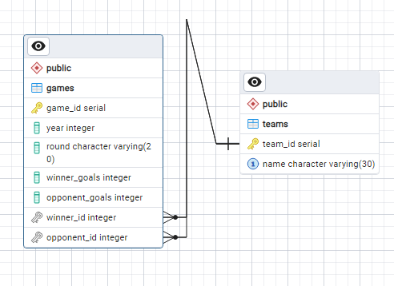

# WorldCup Database

## Project Goal
Create a Bash script that enters information from World Cup games.csv file into PostgreSQL, then query the database for useful statistics.

## Source Files
[games.csv](games.csv)  
[insert_data.sh](insert_data.sh)  
[expected_output.txt](expected_output.txt) 
 
:copyright: [freeCodeCamp](https://www.freecodecamp.org/learn/relational-database/) Relational Database Course

## Instructions
Follow the instructions and get all the user stories below to pass to finish the project.  
You start with several files, one of them is `games.csv`. It contains a comma-separated list of all games of the final three rounds of the World Cup tournament since 2014; the titles are at the top. It includes the year of each `game`, the `round of the game`, the `winner`, their `opponent`, and the `number of goals` each team scored. 
 
You need to do three things for this project:
 
**Part 1: Create the database**  
- Create database `worldcup`, and tables `teams` and `games` on `PostgreSQL`.
- Add appropriate constraints `primary` and `foreign` keys required to relate two tables.
  
  

**Part 2: Insert the data**
 
Complete the `insert_data.sh` script to correctly insert all the data from games.csv into the database. The file is started for you. Do not modify any of the code you start with. Using the `PSQL` variable defined, you can make database queries like this:  
`$($PSQL "<query_here>")`.  
The tests have a 20 second limit, so try to make your script efficient. The less you have to query the database, the faster it will be. You can empty the rows in the tables of your database with `TRUNCATE TABLE games, teams;`

**Part 3: Query the database**  
Complete the empty echo commands in the queries.sh file to produce output that matches the expected_output.txt file. The file has some starter code, and the first query is completed for you. Use the PSQL variable defined to complete rest of the queries. Note that you need to have your database filled with the correct data from the script to get the correct results from your queries. Hint: Test your queries in the psql prompt first and then add them to the script file.

*Notes:*
If you leave your virtual machine, your database may not be saved. You can make a dump of it by entering `pg_dump -cC --inserts -U <database_username> worldcup > worldcup.sql` in a bash terminal (not the psql one). It will save the commands to rebuild your database in worldcup.sql. The file will be located where the command was entered. If it's anything inside the project folder, the file will be saved in the VM. You can rebuild the database by entering psql -U postgres < worldcup.sql in a terminal where the `.sql` file is. 
 

Complete the tasks below
-------------------------

- You should create a database named worldcup
`
CREATE DATABASE worldcup;
`

- You should connect to your worldcup database and then create teams and games tables
- Your teams table should have a `team_id` column that is a type of `SERIAL` and is the `primary key`, and a name column that has to be `UNIQUE`
- Your games table should have a `game_id` column that is a type of `SERIAL` and is the `primary key`, a year column of type `INT`, and a round column of type `VARCHAR`
- Your games table should have `winner_goals` and `opponent_goals` columns that are type `INT`
- All of your columns should have the `NOT NULL` constraint
`
\c worldcup

CREATE TABLE IF NOT EXISTS teams (
    team_id SERIAL PRIMARY KEY NOT NULL,
    name VARCHAR(30) NOT NULL UNIQUE
);

CREATE TABLE IF NOT EXISTS games (
    game_id SERIAL PRIMARY KEY NOT NULL,
    year INT NOT NULL,
    round VARCHAR(20) NOT NULL,
    winner_goals INT NOT NULL,
    opponent_goals INT NOT NULL
);
`

- Your games table should have `winner_id` and `opponent_id` foreign key columns that each reference `team_id` from the teams table
`
ALTER TABLE games ADD COLUMN winner_id INT NOT NULL;
ALTER TABLE games ADD FOREIGN KEY(winner_id) REFERENCES teams(team_id);

ALTER TABLE games ADD COLUMN opponent_id INT NOT NULL;
ALTER TABLE games ADD FOREIGN KEY(opponent_id) REFERENCES teams(team_id);
`

- Your two script (.sh) files should have executable permissions. Other tests involving these two files will fail until permissions are correct. When these permissions are enabled, the tests will take significantly longer to run
`
touch insert_data.sh
chmod +x insert_data.sh

touch queries.sh
chmod +x queries.sh
`

- When you run your `insert_data.sh` script, it should add each unique team to the teams table. There should be 24 rows
- When you run your `insert_data.sh` script, it should insert a row for each line in the `games.csv` file (other than the top line of the file).   There should be 32 rows. Each row should have every column filled in with the appropriate info. Make sure to add the correct ID's from the teams table (you cannot hard-code the values)  
- You should correctly complete the queries in the `queries.sh` file. Fill in each empty echo command to get the output of what is suggested with the command above it. Only use a single line like the first query. The output should match what is in the `[expected_output.txt](expected_output.txt)` file exactly, take note of the number of decimal places in some of the query results

 
 

*Note* that you need to have your database filled with the correct data from the script to get the correct results from your queries.

 
 
